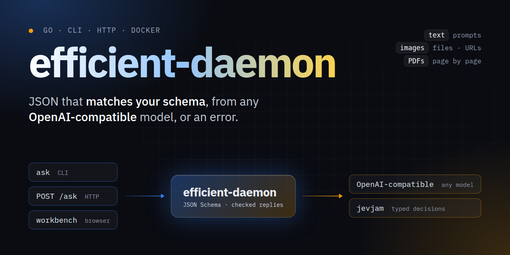

<p align="center">
  
</p>

<p align="center">
  <a href="https://github.com/beremaran/efficient-daemon/actions/workflows/ci.yml"></a>
  <a href="https://github.com/beremaran/efficient-daemon/releases/latest"></a>
  <a href="https://github.com/beremaran/efficient-daemon/pkgs/container/efficient-daemon"></a>
  <a href="LICENSE"></a>
</p>

# efficient-daemon

**A Go CLI and local HTTP service for schema-checked structured output from any OpenAI-compatible API.**

Send a prompt with text, images, or PDFs, and get back JSON that matches your JSON Schema, or an error. Use it from the command line, over HTTP, or in the browser workbench. It also speaks to [jevjam](https://github.com/beremaran/jevjam) for fast typed decisions.

## Install

Download a binary for Linux, macOS, or Windows from the [latest release](https://github.com/beremaran/efficient-daemon/releases/latest), or install with Go:

```sh
go install github.com/beremaran/efficient-daemon/cmd/efficient-daemon@latest
```

Or run the image:

```sh
docker run -d -p 127.0.0.1:8080:8080 ghcr.io/beremaran/efficient-daemon:latest
```

PDF input needs `pdftoppm` (Poppler) or `mutool` (MuPDF) on `PATH`; the image includes Poppler.

## Quick start

Write a schema, `schema.json`:

```json
{
  "type": "object",
  "properties": { "answer": { "type": "string" } },
  "required": ["answer"],
  "additionalProperties": false
}
```

Ask:

```sh
efficient-daemon ask \
  --base-url https://api.example.com/v1 \
  --model your-model-id \
  --api-key "$OPENAI_API_KEY" \
  --schema schema.json \
  "Summarize the main idea in one sentence."
```

Or start the service and open the workbench at `http://127.0.0.1:8080/`:

```sh
efficient-daemon serve --base-url https://api.example.com/v1 --model your-model-id --workbench
```

## Docs

| Guide | What is in it |
| --- | --- |
| [CLI](docs/cli.md) | `ask`, context files, images and PDFs, options |
| [HTTP API](docs/api.md) | `serve`, the workbench, endpoints, security |
| [jevjam](docs/jevjam.md) | The jevjam provider and how schemas map to its questions |
| [Docker](docs/docker.md) | The image, its tags, Compose, settings |

## Contributing

Bug reports and pull requests are welcome; see [CONTRIBUTING.md](CONTRIBUTING.md). Report security problems privately, as [SECURITY.md](SECURITY.md) describes.

## License

efficient-daemon is licensed under the [MIT License](LICENSE). Third-party notices are in [THIRD_PARTY_NOTICES.md](THIRD_PARTY_NOTICES.md).
